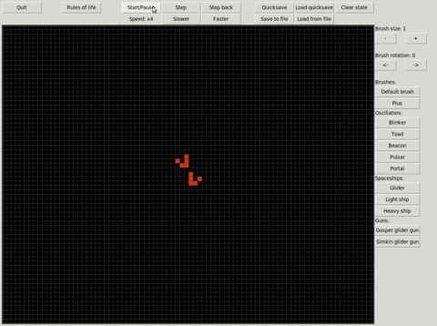
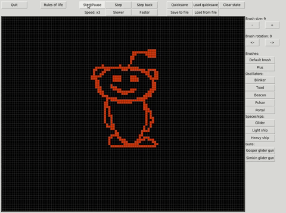

# Game of Life
Game of life application made in python with Tkinter.

The application features an endless grid where you can draw a population and watch it grow according to the rules of life.

## How to use
Download `gameoflife.py` and the `brushmarks` directory, or just the entire repo.

To run program: `python3 gameoflife.py`
### Main controls
* Left click to activate cells
* Right click to deactive cells
* Arrow-keys/WASD/Scroll to move around
* Use top-middle buttons to control simulation
  * Start/Pause
  * Control simulation speed
  * Single step, step backwards
* Use top-right buttons to save and load state
  * Load/Save quicksave (stored in memory)
  * Load/Save save from file
  * Clear state
* Use right buttons to control the brush 
  * Change size of default brush
  * Change rotation of any brush
  * Select a special brush
* Top-left button 'Rules of life' can be used to change the rules of the game.

## Dependencies
* Pillow (https://github.com/python-pillow/Pillow)
* Tkinter
